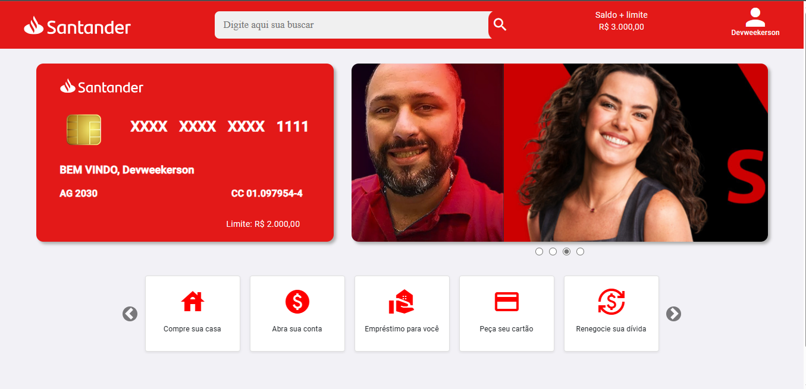

<h1 align="center">
 
   
  Santander Home Clone - Angular
</h1>
 
 ### Meu Projeto:

  <h3>Desktop</h3>
  	
    <h3>Smartphone</h3>
  

### Tecnologias utilizadas: 

  

 
### Desenvolvedor:

| [ Antonio Victor](https://github.com/antoniovictor2k) |
| :---------------------------------------------------------------------------------------------------------------------------------------: |
|                                             [Linkedin](https://www.linkedin.com/in/antonio-victor-pereira-severiano-0aa170169/)                                             |

